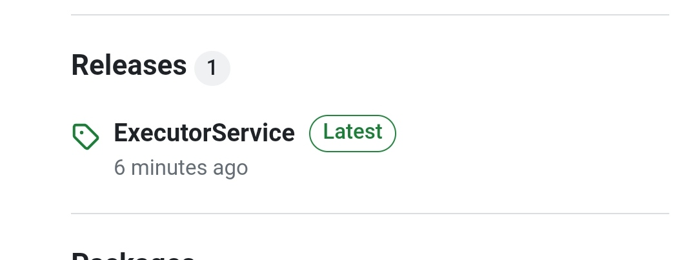
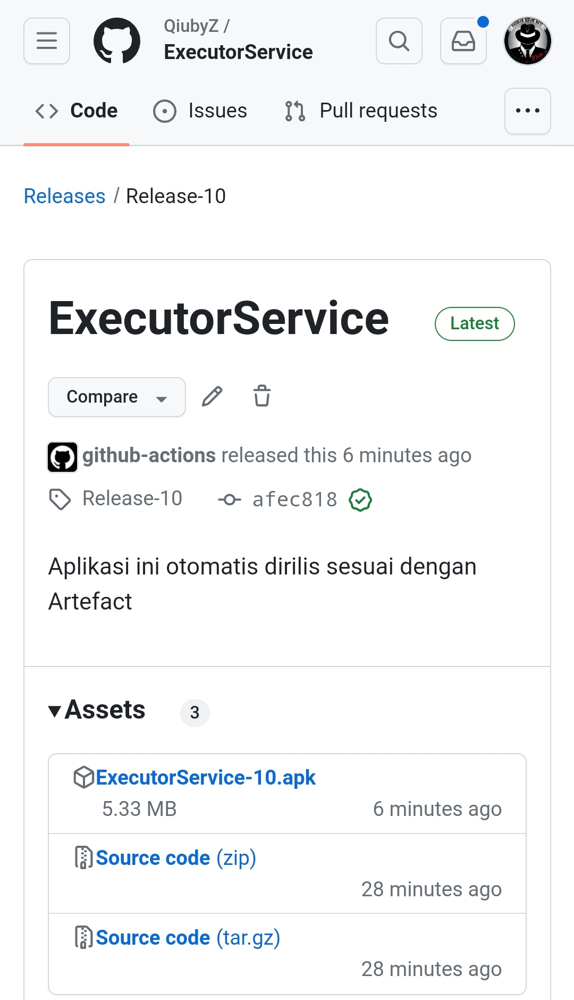
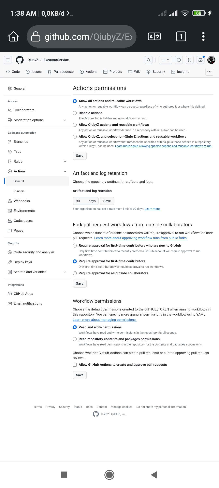

# Simple Release Workflow

The function of this workflow script will automatically build Android applications, upload artifacts, generate Release Tags, and upload Releases based on the Repository name.

# Views on Release





# Requiriment
To run this reusable script, you need to give permissions as in the example in the image below to the repository that you want to apply.



# Guide
It's quite simple to use, 

```yaml
name: Android Release

on:
  push:
    branches: [main]

jobs:
  build:
    runs-on: ubuntu-latest
    steps:
      - uses: actions/checkout@v3

      - uses: QiubyZ/apk-autorelease@v1
        with:
          gradle_cmd: 'assembleDebug' # this is will write apk filename /app-release-unsigned.apk
          tag: 'Production'
          body_release: 'Aplikasi versi produksi dirilis.'
          file_output: './app/build/outputs/apk/debug/app-debug.apk'
```
 
or you can see how this script is called in the Repository that I have shown in the example [See examples here](https://github.com/QiubyZ/QZ-UserDict/blob/main/.github/workflows/android.yml)
